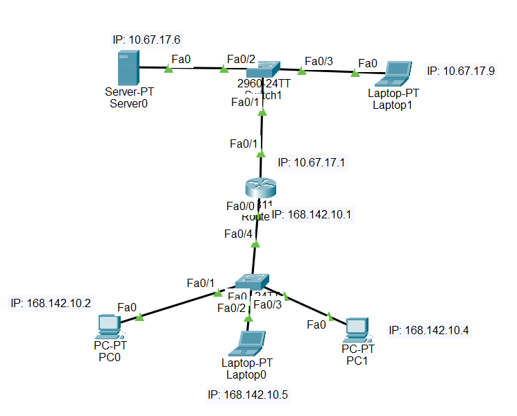
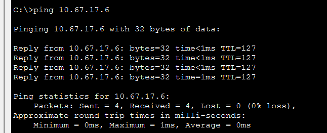
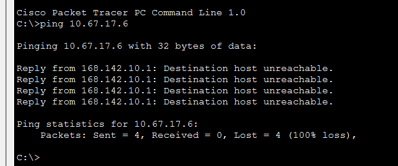
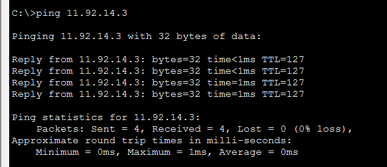
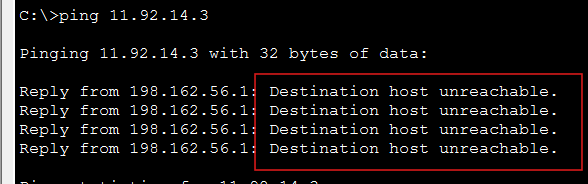
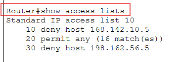

# Access Control List (ACL)

An ACL is a list of permissions attached to a router. It specifies which users or system processes are granted access or not to operate the network.

E.g.
``permit 192.168.1.1``
``deny 192.168.1.2``

## Types of ACL

1. Standard ACL: It filters traffic based on the source IP address only. It is identified by numbers 1-99 and 1300-1999.
2. Extended ACL: It filters traffic based on multiple criteria, including source IP address, destination IP address, protocol, and port numbers. It is identified by numbers 100-199 and 2000-2699.


### Exercise 1. Blocking Access to a Specific Host




In this exercise, we will block access from Laptop 0 to the Server using a standard ACL.

It is important to note that ACLs are applied to interfaces in a specific direction (inbound or outbound). In this case, we will apply the ACL on the interface of the router that connects to the Server, in the outbound direction.

> Laptop → Router → Server

```
    Laptop0 (168.142.10.5)
            │
            │
    Switch
            │
            │
    Router (168.142.10.1)
            │
            │
    Router (10.67.17.1)  ← aplicar ACL aqui
            │
            │
    Switch
            │
            │
    Server (10.67.17.6)
```

ACL:
```
    access-list 10 deny host 168.142.10.5
    access-list 10 permit any
```

Applying ACL to the interface:
```
    interface FastEthernet0/1
    ip access-group 10 out
```



- In this image PC0 comunicates with the Server.



- In this image we can see that the ACL is working, because the ping from PC0 to the Server is unsuccessful.

`Destination host unreachable` means that the host is not reachable, which is the expected result since we have applied an ACL to block access from Laptop 0 to the Server.

### Exercise 2. Blocking Access to a Specific Network


- In this image we can see that PC0 can communicate with the Server.

At the router: Create an ACL to block access from PC0 to the Server's network.

```
    access-list 10 deny host 198.162.56.5
    access-list 10 permit any
```

Apply the ACL to the interface in the outbound direction:
```
    interface FastEthernet0/1
    ip access-group 10 out
```
*remember that the order of the ACL is important, the deny statement must be before the permit statement.




Router → Server network 
filters before outbound traffic leaves the router towards the Server network. 

Since we have denied access from PC0's IP address, the ping from PC0 to the Server will be unsuccessful, resulting in `Destination host unreachable`.



### Exercise 3. Blocking Access to a Specific Protocol