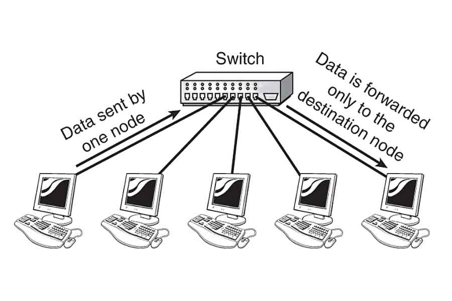
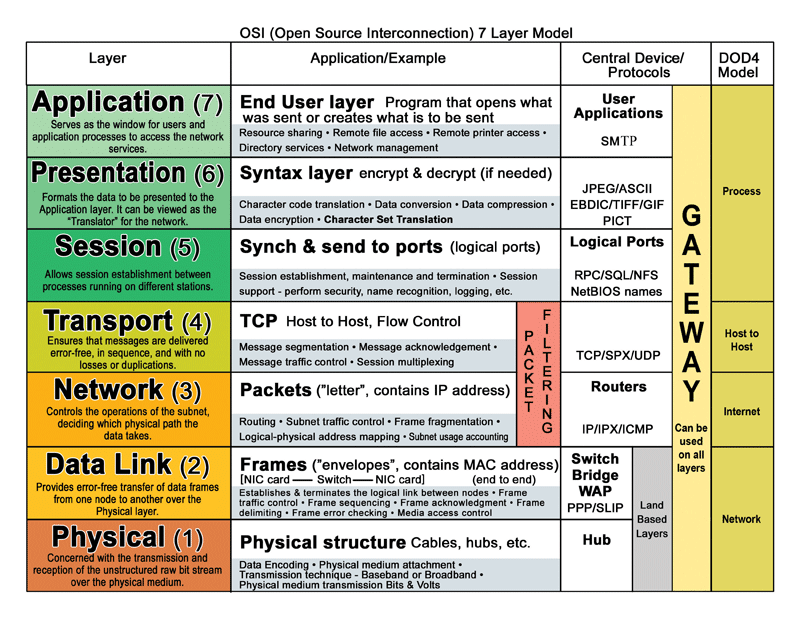
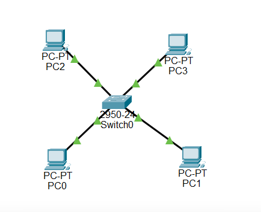
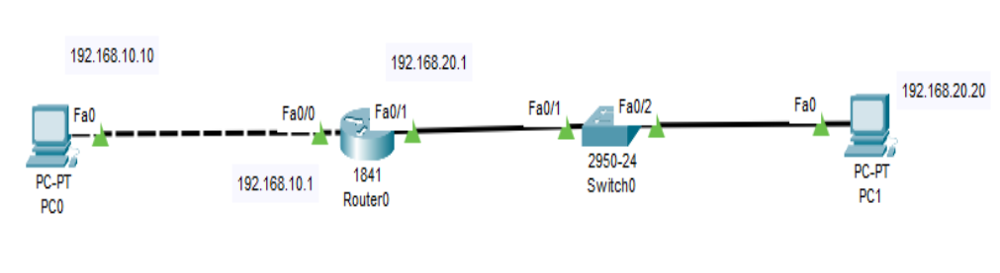

# Lab 01 - Introduction to Cisco Packet Tracer
## Task 01 and 02

#### Explore the switch and establish a connection between a PC and the switch.

The role of a switch in a LAN is:

* To connect devices (PCs, printers, servers) within the same local network.
* To create the Local Area Network (LAN).
* To forward data frames using MAC addresses.
* To send frames only to the correct destination port, not to all devices.
* To reduce collisions and unnecessary traffic, improving network efficiency.
* To operate mainly at Layer 2 (Data Link Layer) of the OSI model.
* To allow devices in the same IP subnet to communicate without a router.

* PS: A LAN is a network that connects devices within a limited geographic area, such as a home or office.
---

## Exercises
* Explored the Cisco Packet Tracer environment to understand the role of a switch in a Local Area Network (LAN): 
* Added a Cisco 2950-24 switch to the workspace.
* Observed that the switch has 24 Fast Ethernet ports (fa0/1 to fa0/24).
* Noted that each switch port has a unique MAC address.
* Understood that switches operate at Layer 2 (Data Link Layer) of the OSI model.
* Learned that switches use MAC addresses (not IP addresses) to forward frames within the same network.
* Explored the Config (GUI) and CLI interfaces for switch configuration.

## Task 03

- Try pinging one PC from another or sending a message between two PCs. What do you observe?

- Can all the PCs communicate with each other successfully? If not, can you identify the possible reasons for the communication failure?

- If you have identified the reason(s), address the issues to ensure all PCs can successfully communicate with each other.

Even though the PCs are connected to the same switch, and they all have IP addresses, they cannot communicate with each other because they are in different networks.

Before:
- PC0: IP: 192.168.1.1
- PC1: IP:  192.168.2.3
- PC2: IP: 192.168.1.3
- PC3: IP: 192.168.2.1

After changing the IP addresses to be in the same network:
- PC0: IP: 192.168.1.1
- PC1: IP: 192.168.1.2
- PC2: IP: 192.168.1.3
- PC3: IP: 192.168.1.4

---

##  Exercise  
* Added a generic PC and a switch to the Packet Tracer workspace.
* Connected the PC to the switch using an Ethernet straight-through cable.
* Learned that straight-through cables are used to connect different devices (PC ↔ Switch).
* Observed the link indicators turning green, confirming a successful physical connection.
* Understood that a physical connection alone does not guarantee communication.
* Identified the need to configure an IP address on the PC for network communication.

## Task 04
### Router

* A network device that connects different networks together.
* Used to send data between LANs or between a LAN and the Internet.
* Operates at Layer 3 (Network Layer) of the OSI model.
* Uses IP addresses to decide where to forward packets.
* Acts as the default gateway for devices in a LAN.
* Determines the best path for data to travel between networks.
* Prevents devices on different networks from communicating unless routing is configured.

PS: CLI Commands Used:

`?` - Displays a list of available commands.
`enable` - Enters privileged EXEC mode.

  

* Created a simple LAN topology using two PCs, one switch, and one router.
* Connected PC0 and PC1 to the switch using Ethernet cables.
* Connected the router to the switch to act as the default gateway.
* Verified that all physical connections were active (green indicators).
* Configured IP addresses and subnet masks on both PCs.
* Set the default gateway on each PC to the router’s IP address.
* Configured the router interface with an IP address.
* Enabled the router interface using the `no shutdown` command.
* Tested connectivity using the `ping` command.
* Successfully pinged between PCs to confirm LAN communication.
* Pinged the router to verify PC–Switch–Router connectivity.

## Task 05

In this task, I built and configured a small network to allow communication between devices on different IP networks.

First, I created the network topology by connecting PC0 directly to a router and PC1 to a switch, which was then connected to the router. The switch was used to extend the local network on the right side, while the router was responsible for connecting the two different networks.

Next, I assigned IP addresses and subnet masks to both PCs.
PC0 was configured in the **192.168.10.0/24** network, and PC1 was configured in the **192.168.20.0/24** network. Because the PCs are in different networks, they cannot communicate directly without a router.

After that, I configured the router using the CLI. Each router interface was assigned an IP address that belongs to a different network. These IP addresses were also configured as the default gateways on the PCs. The router interfaces were then activated using the `no shutdown` command.

Finally, I tested the network using the ping command. Successful ping replies confirmed that the router was correctly routing traffic between the two networks and that full end-to-end communication was working.

