# DYNAMIC HOST CONFIGURATION PROTOCOL(DHCP)

This lab explores the configuration of DHCP (Dynamic Host Configuration Protocol) in different network scenarios. The exercises demonstrate how automatic IP address assignment works using:

* Router as a DHCP server
* Multiple networks
* VLAN environments
* Dedicated DHCP server
* DHCP relay using `ip helper-address`

Each exercise builds on the previous one, increasing network complexity.

---

ps: the server is not needed until ex 4.

# Exercise 1 – Router as DHCP Server (Single Network)

### Scenario

One LAN network:
**10.10.10.0/24**

The router functions as the DHCP server.

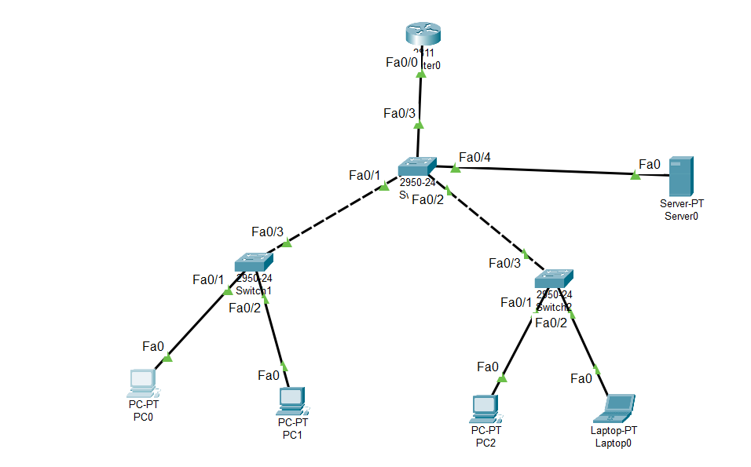

### Configuration Performed

* Assigned IP address to the router interface (10.10.10.1)
* Excluded specific IP addresses from automatic assignment
* Created a DHCP pool
* Defined:

  * Network address
  * Default gateway
  * DNS server

**On router:**

```bash
ip dhcp excluded-address 10.10.10.1 10.10.10.10
ip dhcp pool LAN
 network 10.10.10.0 255.255.255.0
 default-router 10.10.10.1
 dns-server 8.8.8.8
 exit
```

### Result

Devices configured for DHCP automatically received:

* IP address within 10.10.10.0/24
* Default gateway 10.10.10.1

Successful connectivity confirmed via ping.

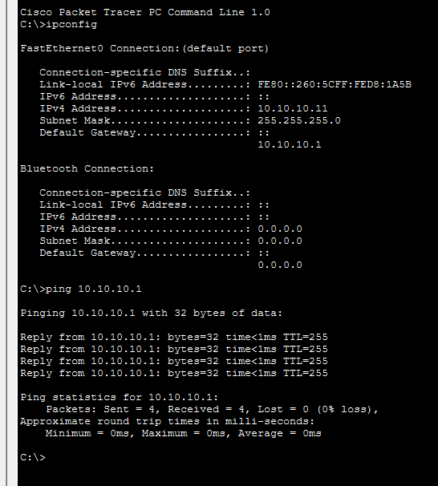

---

# Exercise 2 – Router DHCP for Two Networks

### Scenario

Two separate networks connected to the router:

* 192.168.1.0/24
* 10.10.10.0/24

### Configuration Performed

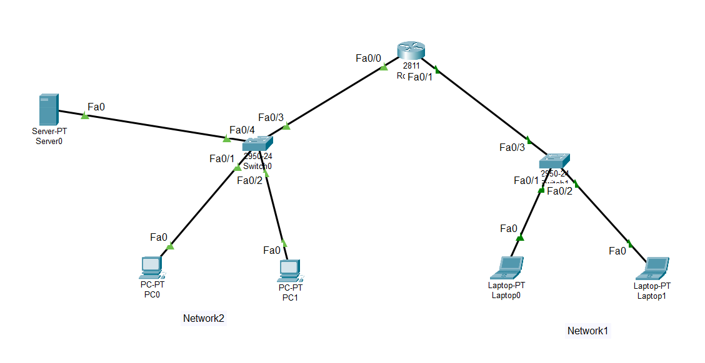

* Assigned IP addresses to both router interfaces
* Created two separate DHCP pools
* Defined gateway and DNS for each network
* Excluded reserved addresses in both ranges

### Result

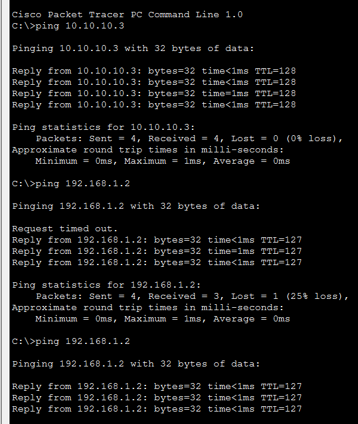

Devices in each network received addresses from their respective DHCP pool.

Routing between both networks functioned correctly through the router.

---

# Exercise 3 – DHCP with VLANs (Router-on-a-Stick)

### Scenario

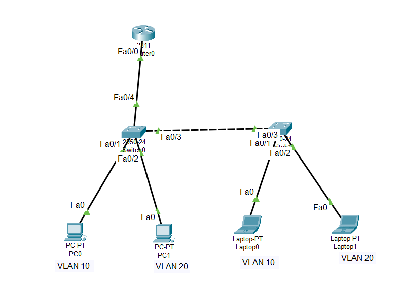


Two VLANs configured on a switch:

* VLAN 10
* VLAN 20

Single physical router interface connected via trunk.

### Configuration Performed

On the switch:

* Created VLAN 10 and VLAN 20
* Configured access ports for each VLAN
* Configured trunk port toward router

On the router:

* Enabled main interface
* Created subinterfaces:

  * fa0/0.10
  * fa0/0.20
* Applied `encapsulation dot1Q`
* Assigned IP addresses for each VLAN
* Created separate DHCP pools for each VLAN

### Result

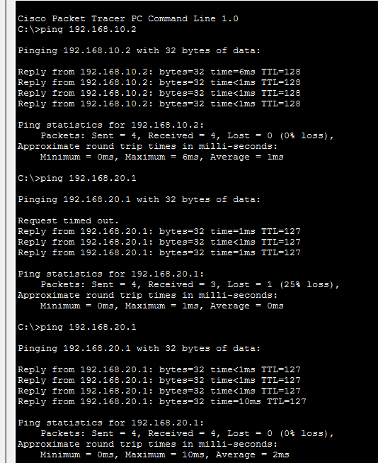

Devices in:

* VLAN 10 received IP addresses from 192.168.10.0/24
* VLAN 20 received IP addresses from 192.168.20.0/24

Inter-VLAN communication succeeded through router-on-a-stick configuration.

---

# Exercise 4 – Dedicated DHCP Server (No VLANs)

### Scenario

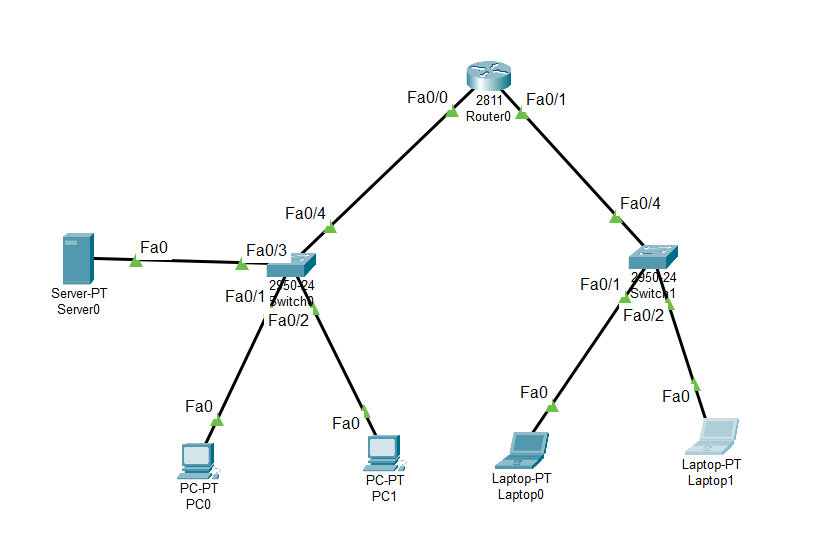


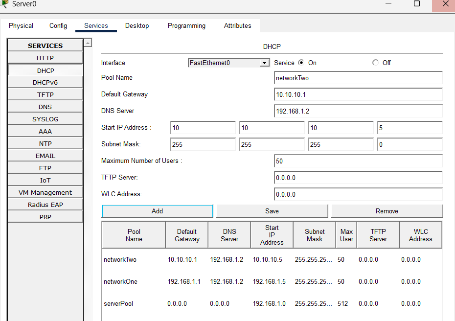


DHCP service moved from router to a Server-PT device.

Router forwards DHCP requests using relay.

### Configuration Performed

On the server:

* Assigned static IP address
* Enabled DHCP service
* Created two DHCP pools
* Configured DNS service

On the router:

* Assigned IP addresses to interfaces
* Configured `ip helper-address` pointing to the DHCP server

### Result

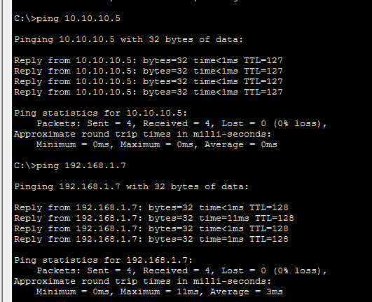


- Devices on the same network can communicate, but devices on different networks cannot ping each other due to lack of routing configuration.

Devices in both networks successfully received IP addresses from the central DHCP server.

DHCP relay allowed broadcast requests to reach the server across networks.


**Troubleshoot**: The default serverPool was covering the hole 192.168.1.0/24, witch caused the DHCP server to assign gateways from that pool instead of the specific pools created. By changing the range of the network at the default pool, the server correctly assigned gateways from the intended pools for each network.

---

# Exercise 5 – DHCP Server with VLANs

### Scenario

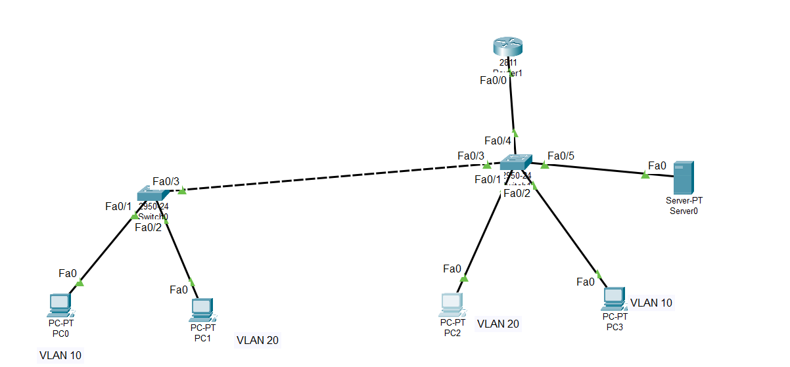


* VLAN 10 and VLAN 20
* Router-on-a-stick configuration
* Central DHCP server
* DHCP relay configured on subinterfaces

### Configuration Performed

On the switch:

* VLAN creation
* Access and trunk configuration

On the router:

* Created subinterfaces for each VLAN
* Assigned IP addresses
* Configured `ip helper-address` on each subinterface

On the server:

* Configured DHCP pools matching each VLAN network

### Result

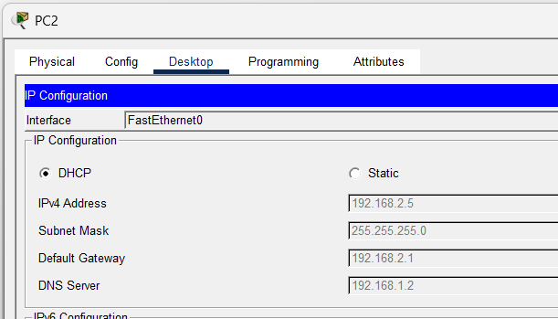


* VLAN 10 devices received addresses from their corresponding pool
* VLAN 20 devices received addresses from their corresponding pool
* Inter-VLAN communication functioned correctly
* DHCP relay enabled centralized IP management

**Troubleshoot**: DHCP was failing because the server (192.168.1.2) was connected to VLAN 1 instead of VLAN 10, preventing communication with hosts on the 192.168.1.0/24 network.

---

# Concepts Demonstrated in This Lab

* Automatic IP address assignment with DHCP
* Multiple DHCP pools on a single router
* DHCP in multi-network environments
* Router-on-a-stick configuration
* VLAN segmentation
* DHCP relay using `ip helper-address`
* Centralized DHCP server architecture
