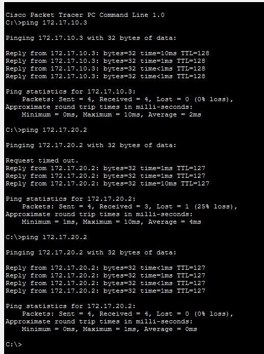
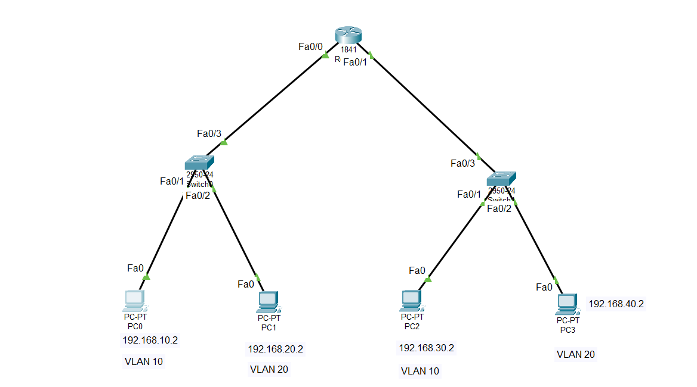

# Lab 3 – Inter-VLAN Routing (Router-on-a-Stick)

## Overview

This lab demonstrates how to configure **Inter-VLAN Routing** using the **Router-on-a-Stick** method in Cisco Packet Tracer.

The objective is to:

* Create VLANs on switches
* Assign access ports to VLANs
* Configure trunk links between switches and router
* Configure router subinterfaces with 802.1Q encapsulation
* Enable communication between devices in different VLANs

---

## Key Concepts

### VLAN (Virtual Local Area Network)

A VLAN logically separates devices into different broadcast domains (a transmission method in which a single device sends data to all other devices connected to the same local area network (LAN) simultaneously), even if they are connected to the same switch.

- Devices on the same VLAN communicate directly.
- Devices on different VLANs do not communicate independently.
- VLAN = logical separation within the same switch

### Trunk Port

A trunk port carries traffic from multiple VLANs using 802.1Q tagging.

- It allows multiple VLANs to pass through the same cable.

### Access Port

An access port belongs to a single VLAN and connects end devices (PCs, printers, etc.).

### Router-on-a-Stick

A method where a single physical router interface is divided into multiple **subinterfaces**, each zN.

- It connects different networks.

---

## General Configuration Steps

### 1. Create VLANs on the Switch

```bash
enable
conf t
vlan <VLAN_ID>
 name <NAME>
exit
```

---

### 2. Configure Access Ports

```bash
interface fa0/x
 switchport mode access
 switchport access vlan <VLAN_ID>
exit
```

---

### 3. Configure Trunk Ports

```bash
interface fa0/x
 switchport mode trunk
 switchport trunk allowed vlan <VLAN_LIST>
exit
```

---

### 4. Configure Router Subinterfaces

```bash
interface fa0/0
 no shutdown
exit

interface fa0/0.<VLAN_ID>
 encapsulation dot1Q <VLAN_ID>
 ip address <GATEWAY_IP> <SUBNET_MASK>
exit
```

---

### 5. Verification Commands

**On Switch:**

```bash
show vlan brief
show interfaces trunk
```

**On Router:**

```bash
show ip interface brief
```

**On PC:**

```
ping <destination_ip>
```

---

# Exercise 1

### Topology

* 2 Switches
* 1 Router
* VLAN 10 and VLAN 20
* Networks:

  * 172.17.10.0/24
  * 172.17.20.0/24

### IP Addressing

| Device | VLAN | IP Address   | Gateway     |
| ------ | ---- | ------------ | ----------- |
| PC0    | 10   | 172.17.10.10 | 172.17.10.1 |
| PC2    | 10   | 172.17.10.11 | 172.17.10.1 |
| PC1    | 20   | 172.17.20.20 | 172.17.20.1 |
| PC3    | 20   | 172.17.20.21 | 172.17.20.1 |

### Tasks

* Create VLAN 10 and 20 on both switches
* Configure trunk between switches
* Configure trunk between switch and router
* Configure router subinterfaces:

  * g0/1.10 → 172.17.10.1
  * g0/1.20 → 172.17.20.1
* Test connectivity between VLANs


---

# Exercise 2

### Topology

* 1 Router
* 2 Switches
* VLAN 5, 10, 15
* Networks:

  * 192.168.5.0/24
  * 192.168.10.0/24
  * 192.168.15.0/24

### IP Addressing

| Device   | VLAN | IP            | Gateway      |
| -------- | ---- | ------------- | ------------ |
| PC0      | 5    | 192.168.5.5   | 192.168.5.1  |
| Laptop0  | 10   | 192.168.10.10 | 192.168.10.1 |
| Printer0 | 15   | 192.168.15.15 | 192.168.15.1 |

### Tasks

* Create VLAN 5, 10, 15
* Configure trunk between switches
* Configure trunk between switch and router
* Configure router subinterfaces:

  * fa0/0.5 → 192.168.5.1
  * fa0/0.10 → 192.168.10.1
  * fa0/0.15 → 192.168.15.1
* Test inter-VLAN communication

---

# Exercise 3

### Topology

* 3 Switches
* 1 Router
* VLAN 10 and 20
* Networks:

  * 172.17.10.0/24
  * 172.17.20.0/24

### IP Addressing

| Device | VLAN | IP          | Gateway     |
| ------ | ---- | ----------- | ----------- |
| PC0    | 10   | 172.17.10.2 | 172.17.10.1 |
| PC2    | 10   | 172.17.10.3 | 172.17.10.1 |
| PC1    | 20   | 172.17.20.2 | 172.17.20.1 |
| PC3    | 20   | 172.17.20.3 | 172.17.20.1 |

### Tasks

* Create VLANs on all switches
* Configure trunks between all switch links
* Configure trunk between main switch and router
* Configure router subinterfaces:

  * fa0/0.10 → 172.17.10.1
  * fa0/0.20 → 172.17.20.1
* Verify inter-switch and inter-VLAN communication




---

# Exercise 4

### Topology

* 1 Router
* 2 Switches
* Two physical router interfaces
* VLAN 10 and 20 on both sides

### Networks

Left Side:

* 192.168.10.0/24
* 192.168.20.0/24

Right Side:

* 192.168.30.0/24
* 192.168.40.0/24

### IP Addressing

| Device | VLAN | IP           | Gateway      |
| ------ | ---- | ------------ | ------------ |
| PC0    | 10   | 192.168.10.2 | 192.168.10.1 |
| PC1    | 20   | 192.168.20.2 | 192.168.20.1 |
| PC2    | 10   | 192.168.30.2 | 192.168.30.1 |
| PC3    | 20   | 192.168.40.2 | 192.168.40.1 |

### Router Configuration

* fa0/0.10 → 192.168.10.1
* fa0/0.20 → 192.168.20.1
* fa0/1.10 → 192.168.30.1
* fa0/1.20 → 192.168.40.1

### Tasks

* Configure VLANs on both switches
* Configure trunk ports toward router
* Configure router subinterfaces on both physical interfaces
* Test full network connectivity

---

# Common Troubleshooting

If ping fails, check:

* VLAN exists (`show vlan brief`)
* Port mode is correct (access vs trunk)
* Trunk allows required VLANs
* Router interface is not shutdown
* Correct gateway configured on PCs
* Correct 802.1Q encapsulation on subinterfaces



---

# Conclusion

This lab demonstrates how VLAN segmentation improves network organization and security, and how a router enables communication between separate broadcast domains using subinterfaces.

By completing these exercises, you should understand:

* VLAN configuration
* Trunking
* Router-on-a-Stick
* Inter-VLAN routing
* Basic network troubleshooting
