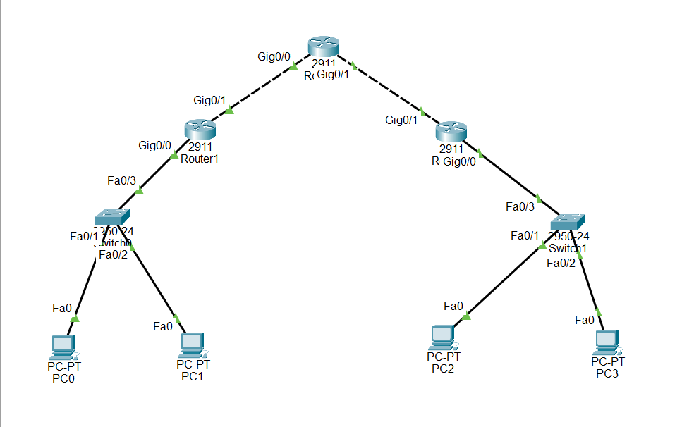
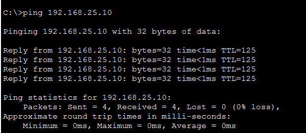
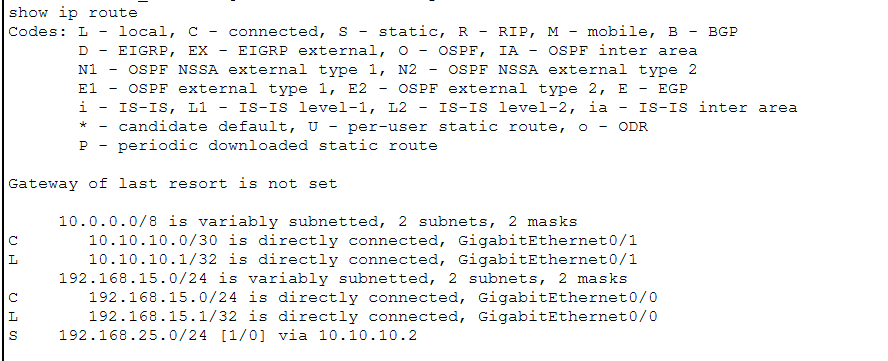
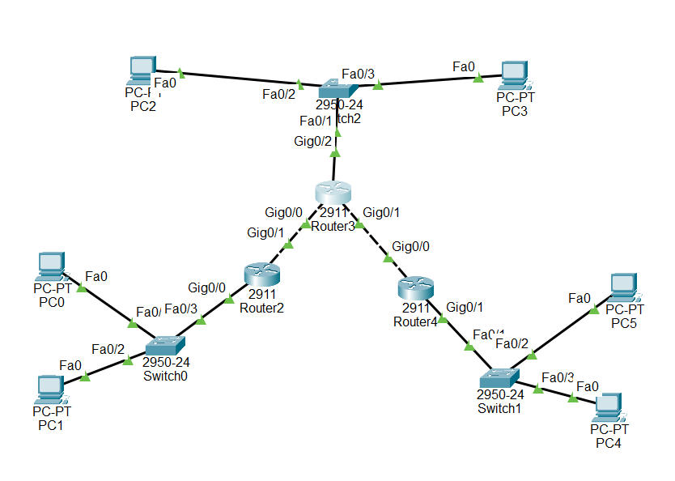
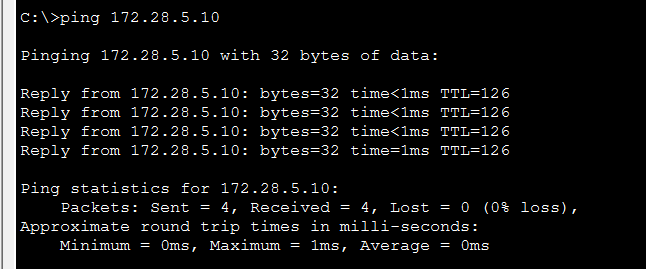
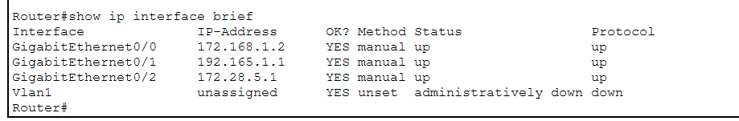
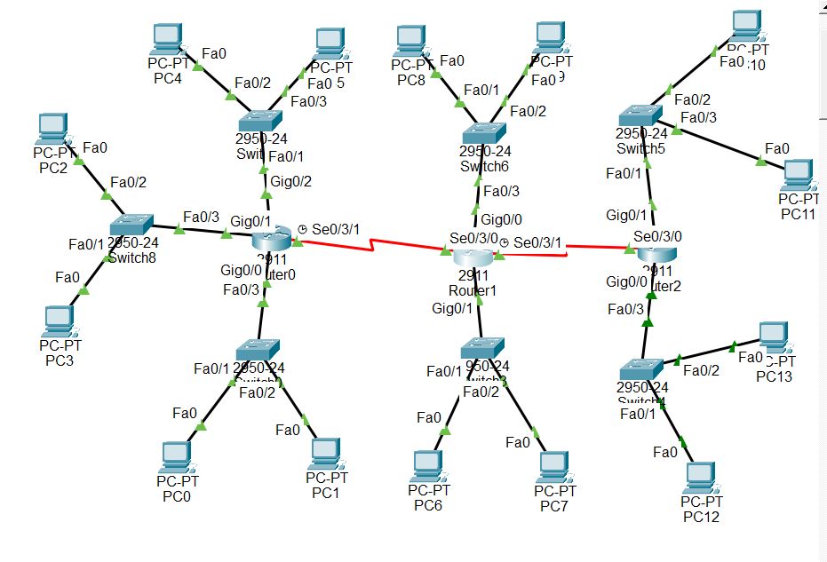
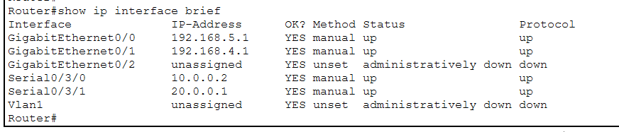

# Static Routing 


The goal of this lab is to implement **static routing** in different multi-router topologies using Cisco Packet Tracer.

By completing this lab, we practice:

* IP addressing configuration
* Interface activation
* Static route configuration (`ip route`)
* End-to-end connectivity validation
* Understanding how routers forward traffic across multiple networks

---

# Exercise 1 – Linear Topology (3 Routers)

### Topology Overview



```
LAN1 — R0 — R1 — R2 — LAN2
```

### Networks

* 192.168.15.0/24 (Left LAN)
* 192.168.25.0/24 (Right LAN)
* 10.10.10.0/30 (R0–R1)
* 20.20.20.0/30 (R1–R2)

### Key Concept

Each router must know how to reach **remote LANs** using static routes.

###  Example Static Routes

**R0**

```bash
ip route 192.168.25.0 255.255.255.0 10.10.10.2
```

**R1**

```bash
ip route 192.168.15.0 255.255.255.0 10.10.10.1
ip route 192.168.25.0 255.255.255.0 20.20.20.2
```

**R2**

```bash
ip route 192.168.15.0 255.255.255.0 20.20.20.1
```
### Results



---

# Exercise 2 – Star/Branch Topology

### Topology Overview

```
        R2
       /   \
     R1     R3
```



### Networks

* 192.168.3.0/24 (Left LAN)
* 172.28.5.0/24 (Center LAN)
* 178.75.56.0/24 (Right LAN)
* 172.168.1.0/24 (R1–R2)
* 192.165.1.0/24 (R2–R3)

### Key Concept

The central router (R2) acts as an intermediary between two edge routers.

### Example Static Routes

**R1**

```bash
ip route 172.28.5.0 255.255.255.0 172.168.1.2
ip route 178.75.56.0 255.255.255.0 172.168.1.2
```

**R2**

```bash
ip route 192.168.3.0 255.255.255.0 172.168.1.1
ip route 178.75.56.0 255.255.255.0 192.165.1.2
```

**R3**

```bash
ip route 192.168.3.0 255.255.255.0 192.165.1.1
ip route 172.28.5.0 255.255.255.0 192.165.1.1
```

### Results



---

# Exercise 3 – Multi-LAN Multi-Router Network

### Topology Overview

Three routers connected in a line, each with multiple LANs.



### Serial Links

* 10.0.0.0/8 (Left–Middle)
* 20.0.0.0/8 (Middle–Right)

### LAN Networks

* Left Router:

  * 192.168.1.0/24
  * 192.168.2.0/24
  * 192.168.3.0/24

* Middle Router:

  * 192.168.4.0/24
  * 192.168.5.0/24

* Right Router:

  * 192.168.6.0/24
  * 192.168.7.0/24

###  Key Concept

Routers must define static routes for **all non-directly connected networks**.

### Example (Left Router)

```bash
ip route 192.168.4.0 255.255.255.0 10.0.0.2
ip route 192.168.5.0 255.255.255.0 10.0.0.2
ip route 192.168.6.0 255.255.255.0 10.0.0.2
ip route 192.168.7.0 255.255.255.0 10.0.0.2
```

### Results



---

#  Verification Commands

After configuration:

```bash
show ip interface brief
show ip route
ping <remote-ip>
```

Checklist:

* Interfaces are `up/up`
* Static routes appear with `S` in routing table
* PCs can ping remote networks

---

#  What I Learned

* Difference between directly connected and remote networks
* How static routing requires manual configuration
* How traffic flows hop-by-hop
* Why scalability is limited with static routes

