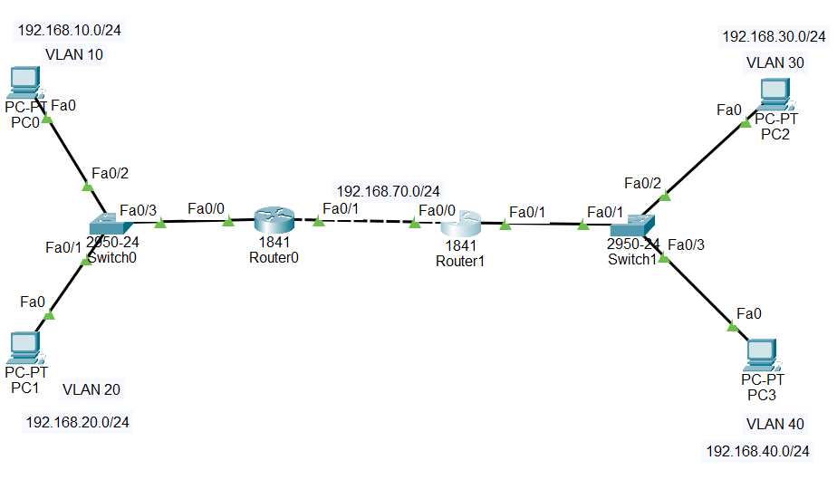
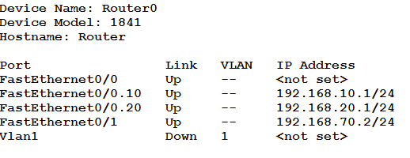
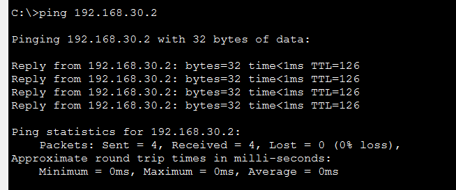
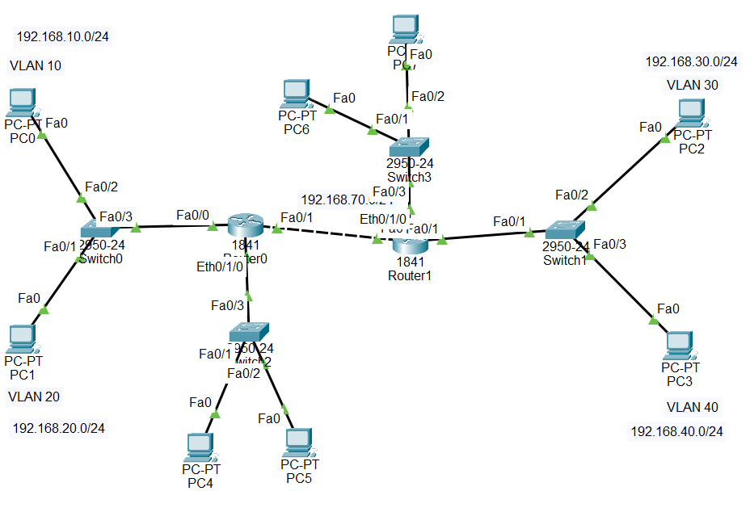

#  Lab 6 – Static Routing and VLAN Configuration


##  Overview

This lab focuses on:

* VLAN configuration
* Router-on-a-Stick (subinterfaces)
* Static routing between routers
* Inter-VLAN communication
* Communication between VLAN and non-VLAN networks

The objective is to ensure seamless communication between all PCs in the network.

---

# Exercise 1 – VLAN + Router-on-a-Stick + Static Routing

## Objective

Create a network topology with:

* 4 VLANs
* Subinterfaces on routers
* Static routes between R0 and R1
* Full connectivity between all VLANs

---

## Network Architecture



### VLANs and Networks

| VLAN    | Network         | Gateway      |
| ------- | --------------- | ------------ |
| VLAN 10 | 192.168.10.0/24 | 192.168.10.1 |
| VLAN 20 | 192.168.20.0/24 | 192.168.20.1 |
| VLAN 30 | 192.168.30.0/24 | 192.168.30.1 |
| VLAN 40 | 192.168.40.0/24 | 192.168.40.1 |

### Inter-Router Network

| Connection | Network         |
| ---------- | --------------- |
| R0 ↔ R1    | 192.168.70.0/24 |

---

## Step 1 – VLAN Configuration (Switch)

```bash
enable
conf t

vlan 10
name VLAN10

vlan 20
name VLAN20
```

Assign access ports:

```bash
interface fa0/1
switchport mode access
switchport access vlan 10

interface fa0/2
switchport mode access
switchport access vlan 20
```

Configure trunk port:

```bash
interface fa0/3
switchport mode trunk
switchport trunk allowed vlan 10,20
exit
```

---

## Step 2 – Router-on-a-Stick (R0)

```bash
enable
conf t

interface fa0/0
no shutdown
```

Create subinterfaces:

```bash
interface fa0/0.10
encapsulation dot1Q 10
ip address 192.168.10.1 255.255.255.0

interface fa0/0.20
encapsulation dot1Q 20
ip address 192.168.20.1 255.255.255.0
```

---

## Step 3 – Inter-Router Configuration

### On R0

```bash
interface fa0/1
ip address 192.168.70.1 255.255.255.0
no shutdown
```

### On R1

```bash
interface fa0/1
ip address 192.168.70.2 255.255.255.0
no shutdown
```




---

## Step 4 – Configure R1 VLANs

```bash
interface fa0/0
no shutdown

interface fa0/0.30
encapsulation dot1Q 30
ip address 192.168.30.1 255.255.255.0

interface fa0/0.40
encapsulation dot1Q 40
ip address 192.168.40.1 255.255.255.0
```

---

## Step 5 – Static Routing

### On R0

```bash
ip route 192.168.30.0 255.255.255.0 192.168.70.2
ip route 192.168.40.0 255.255.255.0 192.168.70.2
```

### On R1

```bash
ip route 192.168.10.0 255.255.255.0 192.168.70.1
ip route 192.168.20.0 255.255.255.0 192.168.70.1
```

---

## Verification

Use:

```bash
show ip route
```

Test connectivity:

```bash
ping 192.168.30.2
```


Analysing the photo: PC in VLAN 20 pinged PC in VLAN 30 successfully, confirming inter-VLAN and inter-router communication.

All PCs across VLANs should communicate successfully.

---

# Exercise 2 – Adding Non-VLAN Networks

## Objective

Extend the topology by:

* Adding one Ethernet interface to R0 and R1 (Module WIC-1ENET)
* Connecting additional PCs outside VLANs
* Ensuring full communication between all networks



---

## 🗺 New Networks

| Router | Network         | Gateway      |
| ------ | --------------- | ------------ |
| R0     | 192.168.50.0/24 | 192.168.50.1 |
| R1     | 192.168.60.0/24 | 192.168.60.1 |

---

## Configure R0

```bash
interface eth0/0
ip address 192.168.50.1 255.255.255.0
no shutdown
```

Add static route:

```bash
ip route 192.168.60.0 255.255.255.0 192.168.70.2
```

---

## Configure R1

```bash
interface eth0/0
ip address 192.168.60.1 255.255.255.0
no shutdown
```

Add static route:

```bash
ip route 192.168.50.0 255.255.255.0 192.168.70.1
```

---

## Final Expected Result

All PCs must be able to communicate:

* VLAN ↔ VLAN
* VLAN ↔ Non-VLAN
* Non-VLAN ↔ Non-VLAN

---

# Key Concepts Learned

* VLAN segmentation
* Inter-VLAN routing
* 802.1Q encapsulation
* Static routing configuration
* Multi-network communication design

---

# Common Issues

* Forgetting `no shutdown`
* Incorrect gateway on PCs
* Trunk port not configured
* Missing static routes

