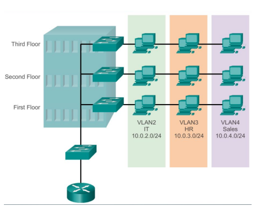
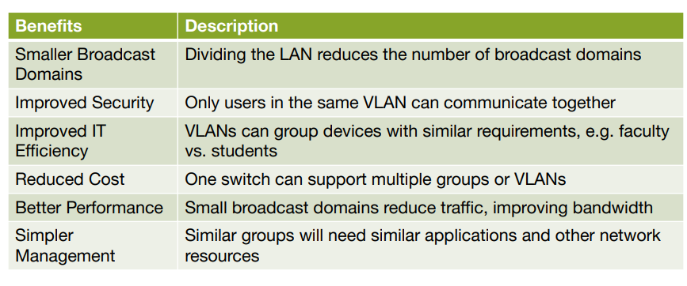

# Virtual Local Area Networks

Network that groups devices logically within a network to improve performance, enhance security, and simplify management.

### How can you determine if two computers are part of the same network?

- Check their IP addresses and subnet masks. If the network portions of their IP addresses (determined by the subnet mask) are the same, they are in the same network.
- For example, with a subnet mask of 255.255.255.0, the first three octets (numbers) of the IP addresses must be identical for the devices to be in the same network.
- Example:
    - PC1: IP: 192.168.1.10, Subnet Mask: 255.255.255.0
    - PC2: IP: 192.168.1.20, Subnet Mask: 255.255.255.0
    - Both PCs are in the same network (192.168.1.0/24).

** (0/24) - indicates that the first 24 bits of the IP address are used for the network portion. **

### What is the purpose of a switch in a Local Area Network (LAN)?
* To connect devices (PCs, printers, servers) within the same local network.
* To create the Local Area Network (LAN).
* To forward data frames using MAC addresses.
* To send frames only to the correct destination port, not to all devices.
* To reduce collisions and unnecessary traffic, improving network efficiency.
* To operate mainly at Layer 2 (Data Link Layer) of the OSI model.
* To allow devices in the same IP subnet to communicate without a router.

## VLAN





• A VLAN is a logical partition of a Layer 2 network.
• Segments a physical network into multiple logical networks.
• Allows devices to be grouped by function ordepartment, independent of physical location.
• Each VLAN will have its own unique range of IP addressing.
• Broadcasts, multicasts and unicasts are isolated in the individual VLAN.
• Enhances network security by limiting access between VLANs.
• Simplifies network management and administration.




### Types of VLANs:
1. **Default VLAN**: All switch ports are part of VLAN 1 by default.
2. **Data VLAN**: Used to separate user-generated data traffic (email and web traffic). 
3. **Native VLAN**: Used for untagged traffic on trunk ports.
4. **Management VLAN**: Used for network device management traffic (e.g., switch management) - (SSH/Telnet VTY).
5. **Voice VLAN**: Used to separate voice traffic (VoIP) from data traffic for better quality of service (QoS).

## Creating a VLAN on a Switch
1. Access the switch's command-line interface (CLI) via console, SSH, or Telnet.
2. Enter privileged EXEC mode by typing `enable` and providing the necessary password.
3. Enter global configuration mode by typing `configure terminal`.
4. Create a VLAN by typing `vlan [VLAN_ID]`, replacing `[VLAN_ID]` with the desired VLAN number (1-4094).
5. Optionally, assign a name to the VLAN using the command `name [VLAN_NAME]`, replacing `[VLAN_NAME]` with a descriptive name.
6. Exit VLAN configuration mode by typing `exit`.

7. Assign switch ports to the VLAN by entering interface configuration mode for each port using the command `interface [INTERFACE_ID]`, replacing `[INTERFACE_ID]` with the specific port identifier (e.g., `GigabitEthernet0/1`).
8. Assign the port to the VLAN using the command `switchport access vlan [VLAN_ID]`.
9. Exit interface configuration mode by typing `exit`.

### VLAN Trunks

A VLAN trunk is a network link that carries multiple VLANs between switches or other network devices. It allows for the transmission of traffic from different VLANs over a single physical connection.

• Traffic from different VLANs is tagged using the 802.1Q protocol to identify
which VLAN it belongs to.


## Exercise 1 - VLAN 10 & VLAN 20 – Lab Summary

### Goal

* Create **VLAN 10 (Student)** and **VLAN 20 (Staff)**
* Connect **two switches** using a **trunk**
* Allow:

  * VLAN 10 ↔ VLAN 10 communication
  * VLAN 20 ↔ VLAN 20 communication
  * ❌ No communication between VLAN 10 and VLAN 20 (no router)

---

## Physical Connections (very important)

### Switch0

* **PC0 → Fa0/1 → VLAN 10**
* **PC2 → Fa0/2 → VLAN 20**
* **Switch-to-switch link → Fa0/3 (TRUNK)**

### Switch1

* **PC1 → Fa0/1 → VLAN 20**
* **PC3 → Fa0/2 → VLAN 10**
* **Switch-to-switch link → Fa0/3 (TRUNK)**

👉 **The trunk must be on the port where the cable is actually connected.**

---

## VLAN Configuration (on BOTH switches)

```bash
vlan 10
 name Student
vlan 20
 name Staff
```

**Reason:** VLANs do not propagate automatically between switches.

---

## PC Ports (ACCESS mode)

### Switch0

```bash
interface fa0/1
 switchport mode access
 switchport access vlan 10

interface fa0/2
 switchport mode access
 switchport access vlan 20
```

### Switch1

```bash
interface fa0/1
 switchport mode access
 switchport access vlan 20

interface fa0/2
 switchport mode access
 switchport access vlan 10
```

**Reason:** PCs do not understand VLANs; the switch port assigns the VLAN.

---

## Trunk Configuration (on BOTH switches)

```bash
interface fa0/3
 switchport mode trunk
 switchport trunk native vlan 1
 switchport trunk allowed vlan 10,20
```

**Reason:** The trunk carries traffic for multiple VLANs between switches.

---

## IP Configuration

### VLAN 10

* PC0 → `192.168.20.2 /24`
* PC3 → `192.168.20.3 /24`

### VLAN 20

* PC1 → `192.168.10.2 /24`
* PC2 → `192.168.10.3 /24`

**Gateway:** empty (no router)

**Reason:** Devices in the same VLAN must be in the same IP network.

---

## Verification Commands

```bash
show vlan brief
show interfaces trunk
show mac address-table
```

**Key idea:**
Ping works only when **both local and remote MAC addresses** appear in the MAC table.

---

## Final Result

* ✅ VLAN 10 works across both switches
* ✅ VLAN 20 works across both switches
* ❌ VLAN 10 ↔ VLAN 20 (expected, no routing)
* ✅ Trunk correctly configured
* ✅ Ping successful

If you want, I can also turn this into a **very short exam-style answer** or a **debug checklist**.

